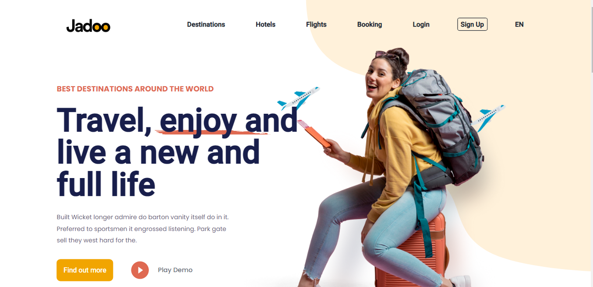
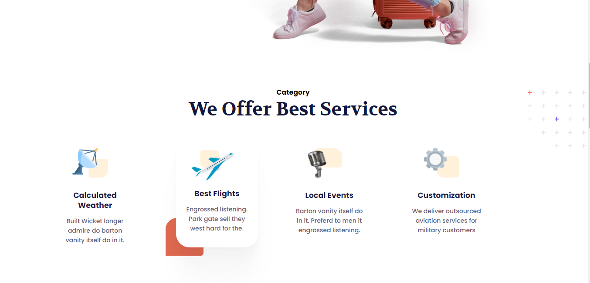
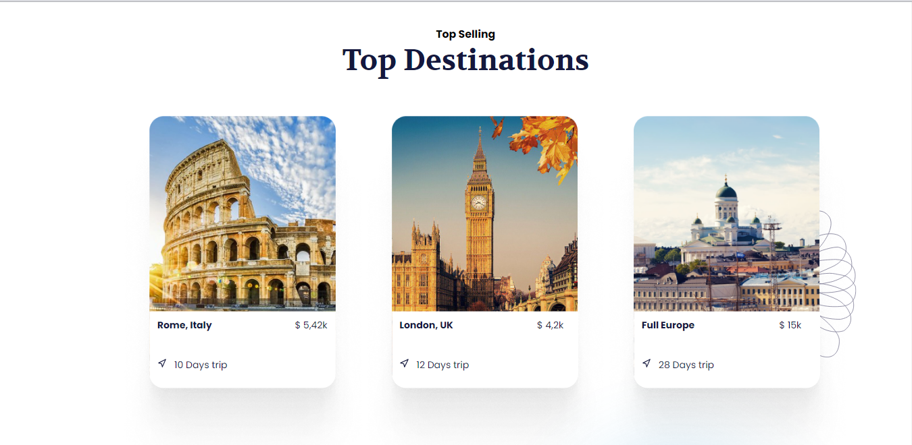
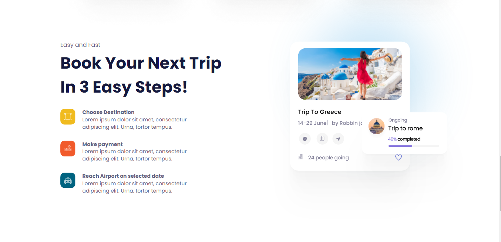
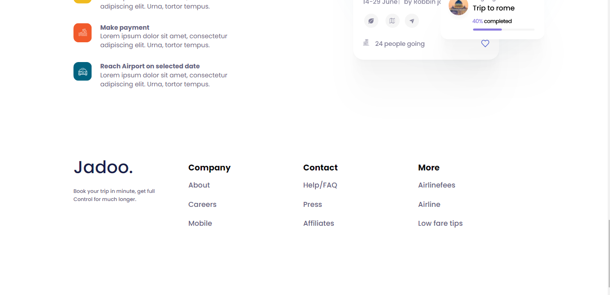

<h1 align="center">
  
</h1>

 

## 📌 | About this project

This project is about a travel platform, showing tips on destinations and services it can offer. Some details are missing, but my initial task is to deliver the home page.

I'll add other features later, I'll take the opportunity to put CI/CD skills into practice. With several projects in parallel, it took me longer to get the prints working. I will add new features soon...

 

## 🚀 | What technologies that I used?

- [Next.js](https://nextjs.org/)
- [TypeScript](https://www.typescriptlang.org/)
- [Sass](https://sass-lang.com/)

and I used too react-icons for icon style.

 

## 💻 | Layout

I'm pleased to deliver so far, I was able to put into practice some concepts that I studied a few months ago.

 

  
  
  
  
  

 

I see you later, bye 👋🏻

Developed with ❤️ by [Vinicius de Souto](https://github.com/soutovnc)
